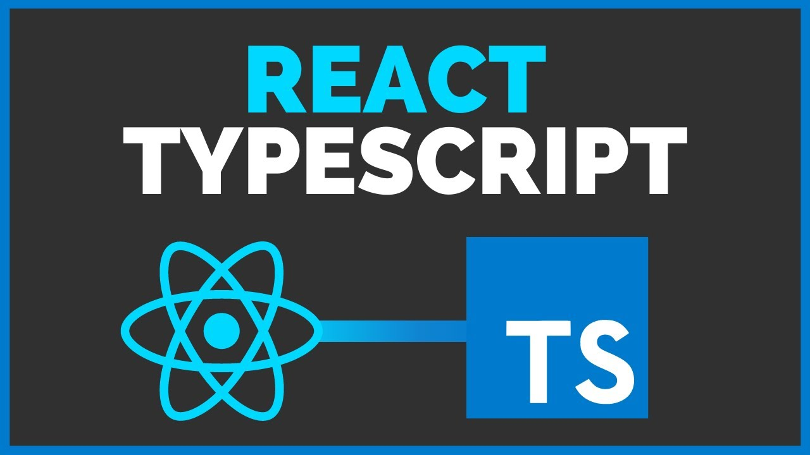
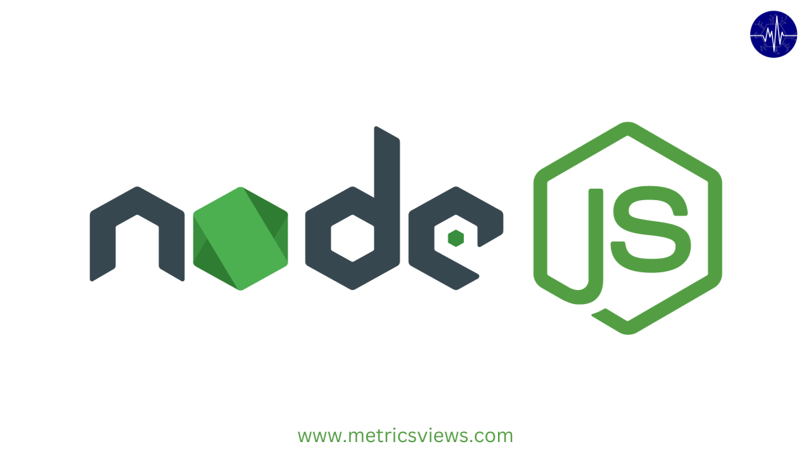
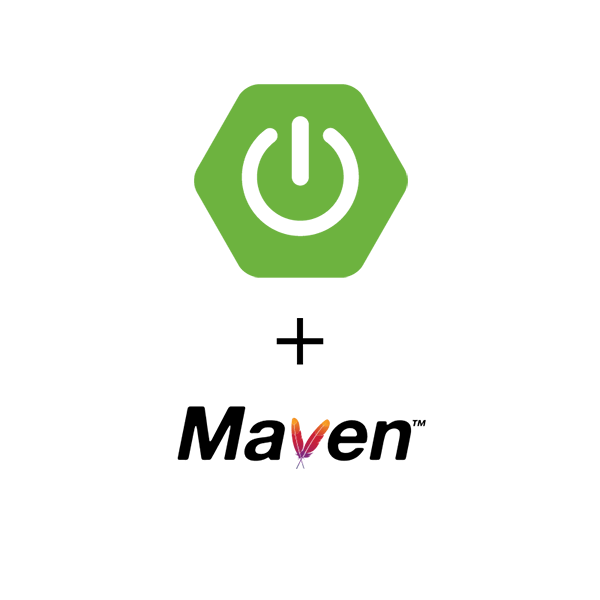

# wiq_es1d

[](https://sonarcloud.io/summary/new_code?id=Arquisoft_wiq_es1d)
[](https://sonarcloud.io/summary/new_code?id=Arquisoft_wiq_es1d)

<p float="left">
    
    
    
</p>

This is a project based on Node.js and Java, using the technologies of React + TypeScript for the frontend and Spring Boot + Maven for the backend.

This repo is a basic application composed of several components.

- **Frontend module**. Module based on React + TypeScript, which utilizes the Keycloak service for authentication, shaping the entire interface through which users will interact.
- **Backend module**. Module based on Maven along with Spring Boot, containing all the business logic of the app, communicates with the database, and is protected by the Keycloak service.
- **Keycloak service**. Service based on the Keycloak framework to protect, secure, and authenticate the different necessary parts of the project.

## Requierements
- Node.js
- Npm
- Maven
  
## Quick start guide

### Using docker

The fastest way for launching this sample project is using docker. Just clone the project:

```sh
git clone https://github.com/Arquisoft/wiq_es1d.git
```

Access the 'docker' folder located at the root:

```sh
cd docker
```

and launch it with docker compose:

```sh
docker-compose -f ./docker-compose-dev.yml up --build
```

After the deployment is completed, Docker will build six images to subsequently launch the six containers:

- Backend
- Frontend
- Database
- Keycloak service
- Two containers for API monitoring (Prometheus and Grafana)

Once the containers are up and running, you can access the website through port 3000.

### Starting Component by component

First, start the database. Either install and run Mysql or run it using docker:

```docker run -d -p 3306:3306 --name=syg-db:latest```

Do the same with keycloak

```docker run -d -p 8090:8080 --name=keycloak:latest```

Now, with docker or any IDE you can run the backend with your IDE or with docker like the others components:

```docker run -d -p 8080:8080 --name=backend:latest```

Finally, to deploy the frontend, you can navigate to the frontend module folder and use:

```npm start```

or with docker too:

```docker run -d -p 3000:80 --name=frontend:latest```

After all the components are launched, the app should be available in localhost in port 3000.

## Miembros del equipo:
- Álvaro González Carracedo - UO251891
